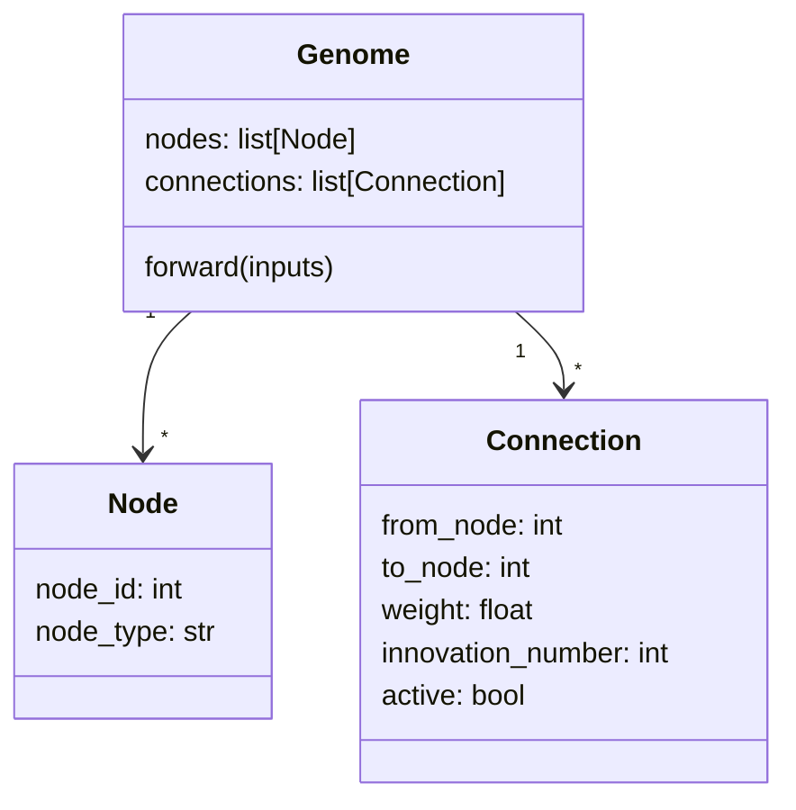
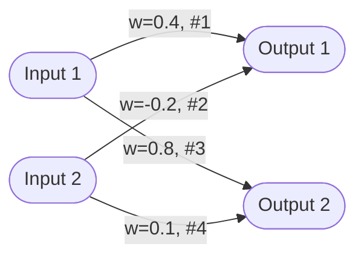
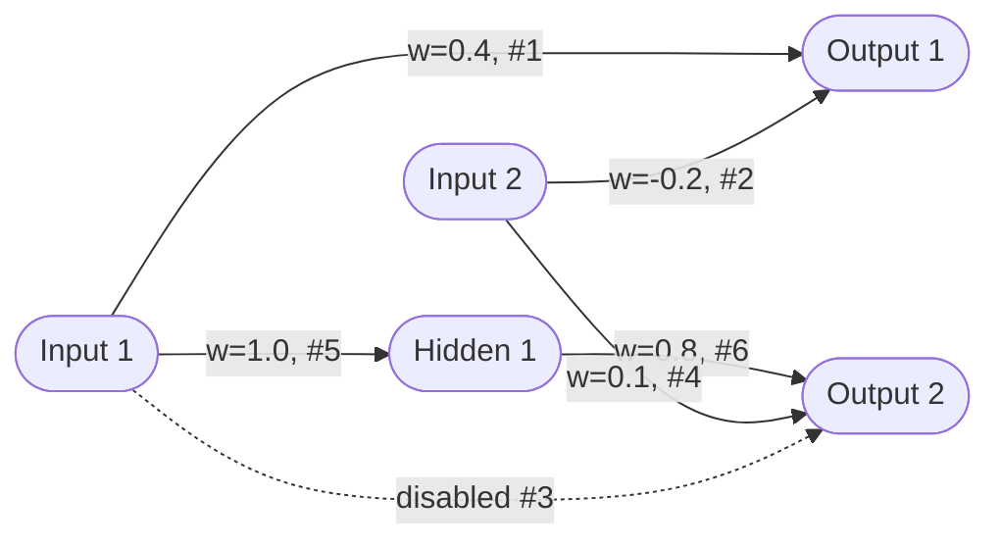
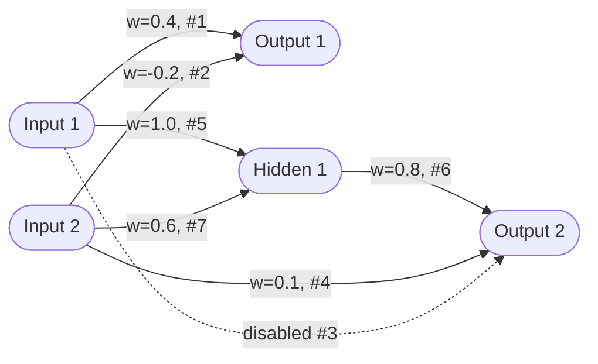

# NEAT Theory — NeuroEvolution of Augmenting Topologies

## The problem with fixed-topology evolution (exp 03)

In experiment 03, the neural network architecture was hardcoded: 4 inputs → 6 hidden neurons → 2 outputs.
Evolution could only tune the **weights** — 36 numbers in fixed-size matrices.

This has two fundamental limitations:

1. **You must guess the right architecture** before running the simulation. Too few hidden neurons and the network can't represent complex behaviors. Too many and the search space explodes, making evolution slow.

2. **The architecture can never adapt**. If the optimal solution needs a direct shortcut from input to output (bypassing hidden neurons), or needs 10 hidden neurons instead of 6, evolution can never find it.

NEAT solves both by letting evolution discover the architecture itself.

---

## What NEAT evolves

NEAT evolves a **Genome** — not a matrix, but a list of explicit objects:

- **Nodes** (neurons): each has an ID and a type (input / hidden / output)
- **Connections**: each links two nodes with a weight, and can be active or inactive

Every network starts **minimal**: only input nodes connected directly to output nodes. Complexity grows only when mutations prove useful.

### Genome structure



### Network evolution over generations

**Generation 1 — minimal network** (inputs wired directly to outputs):


**After "add node" mutation** (connection #3 is split):


**After "add connection" mutation** (new link added):


---

## Innovation numbers

### The crossover problem

In exp 03, crossover was simple because both parents had identically-shaped matrices `(4, 6)`.
With variable topologies, parent 1 might have 5 connections and parent 2 might have 12. You can't use `np.where` on different shapes.

### The solution: historical markings

Every time a new connection appears anywhere in the population, it receives a **global unique ID** called an innovation number.

```
Connection A→B appears in generation 3  →  innovation #7
Connection A→C appears in generation 5  →  innovation #8
Connection B→C appears in generation 5  →  innovation #9
```

This number is permanent and global. If the same connection `A→B` independently appears in two different genomes, they both get innovation #7 — not two different numbers.

### How crossover works with innovation numbers

```
Parent 1:  [#1] [#2] [---] [---] [#7]
Parent 2:  [#1] [#2] [#3] [#5] [#7] [#8]
```

- **Matching genes** (same innovation number in both parents) → inherit 50/50, just like exp 02-03
- **Disjoint/excess genes** (only in one parent) → inherit from the fitter parent, or keep with some probability

Result: a child with a coherent topology that may differ from both parents.

---

## Structural mutations

Beyond weight mutation (same as exp 03), NEAT adds two new mutation types:

### Add connection
Pick two unconnected nodes and add a new connection between them with a random weight.
The `InnovationTracker` assigns the next available innovation number (or returns an existing one if this connection already appeared before).

### Add node
Split an existing connection `A→B` into two:
- Disable the original connection `A→B`
- Add a new hidden node `X`
- Add connection `A→X` (weight = 1)
- Add connection `X→B` (weight = original weight)

Why weight 1 and original weight? This makes the new node initially **neutral** — the network behaves exactly as before, giving the new node time to be optimized.

### Toggle connection
Reactivate a disabled connection. Disabled connections are never deleted — they remain in the genome as historical record and can be reactivated by mutation.

---

## Why keep disabled connections?

Deleting a connection would erase its innovation number from the genome.
During future crossovers, there would be no way to know that this connection was once tested.

By keeping it disabled, the child can inherit it — and a future mutation can reactivate it.
Evolution can revisit abandoned paths.

---

## Speciation

### The problem: nascent innovation

When a mutation adds a new connection or node, the new weights are random.
The network is now more complex but not yet optimized.

In an unprotected population, this mutant competes against genomes that have had many generations to optimize their simpler topologies. The mutant will almost certainly die before its innovation has time to prove its value.

### The solution: compete only against similar genomes

NEAT groups genomes into **species** based on structural similarity. A genome is assigned to a species if its distance to the species representative is below a threshold.

**Distance** is calculated from:
- Number of disjoint/excess genes (structural difference)
- Average weight difference on matching genes

Within a species, genomes compete only against each other. A species with promising innovations survives even if it's currently outperformed by simpler, more optimized species.

Species that stagnate (no fitness improvement for N generations) are eventually eliminated.

---

## NEAT vs simple neural network evolution (exp 03)

| Aspect | Exp 03 | NEAT |
|--------|--------|------|
| **Architecture** | Fixed (4→6→2) | Evolves from minimal |
| **Genome** | Two weight matrices | List of Node and Connection objects |
| **Crossover** | `np.where` on same-shape matrices | Alignment by innovation number |
| **Mutations** | Weight perturbation only | Weight + add node + add connection + toggle |
| **Population structure** | Flat (all compete together) | Speciated (compete within species) |
| **Starting complexity** | Full architecture from generation 1 | Minimal, grows as needed |
| **Search space** | Fixed 36 dimensions | Variable, expands only when useful |

---

## Key insight

NEAT doesn't just tune weights — it searches **architecture space** and **weight space simultaneously**.
A small network with the right topology can outperform a large network with optimal weights for a fixed topology.

The innovation number mechanism is the mathematical trick that makes this possible: it gives every connection a shared identity across the entire population, so genomes with different structures can still be meaningfully compared and combined.